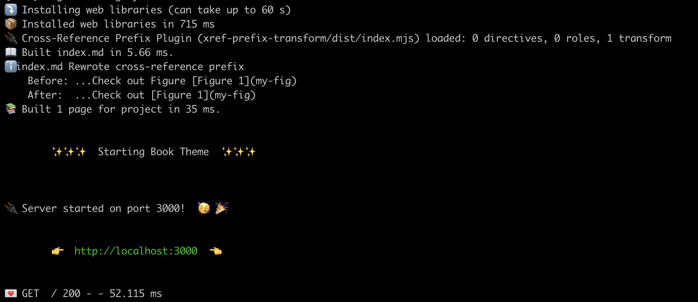

# myst-ext-xref-prefix

MyST plugin for fixing cross-references where both the text and the cross-reference say "Figure" - this happens often with LaTeX autorefs.



## Development

To develop this package, you may run

```bash
npm install
npm run test
npm run lint
```

Then, to add the plugin to your MyST build, you must build the `.mjs` file:

```bash
npm run build
```

Then link to the built file from you `myst.yml`:

```yaml
project:
  ...
  plugins:
    - xref-prefix-plugin/dist/index.mjs
```
